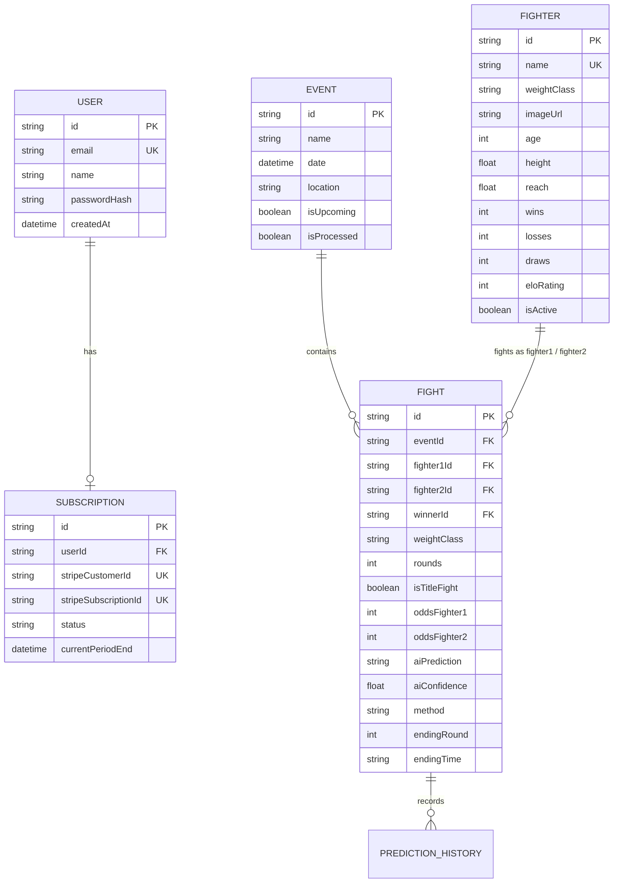

# 🥋 Octagon AI — UFC & MMA Analytics SaaS Platform

Octagon AI is a premium, data-driven sports analytics and predictive forecasting platform for the Ultimate Fighting Championship (UFC) and Mixed Martial Arts (MMA). It features automated live scrapers, dynamic Elo ratings, AI matchup simulators, and a robust Stripe-powered subscription paywall.

---

## 🚀 Technical Highlights

- **Dynamic On-Demand Scraper**: If an upcoming event is accessed but has not yet been scraped, the platform triggers an automatic on-demand sync of the fight card directly from UFC.com.
- **Stripe SDK Dahlia Integration**: Standardized on Stripe API version `2026-04-22.dahlia` with robust webhook handling for invoice updates, customer updates, deletions, and checkout sessions.
- **Database-Validated NextAuth Sessions**: Solves the next-auth JWT session staleness problem by querying subscription statuses in real-time from the database on every token validation, ensuring instant premium access.
- **UFC Hotlink Bypass**: Bypasses UFC's asset hotlink protection rules using a custom, fallback-safe `<FighterAvatar>` client component executing `referrerPolicy="no-referrer"`.
- **Deduplicated Data Pipelines**: Smart database transaction scripts prevent double-insertion of fighter rosters and matchups even during concurrent webhook payloads.

---

## 🛠️ Tech Stack

- **Framework**: [Next.js 16 (App Router)](https://nextjs.org/)
- **Runtime & Language**: Node.js & TypeScript
- **Database**: Serverless PostgreSQL via [Neon DB](https://neon.tech/)
- **ORM**: [Prisma Client](https://www.prisma.io/)
- **Authentication**: [NextAuth.js](https://next-auth.js.org/) (Credentials Provider + JWT Strategy)
- **Payment Processing**: [Stripe API](https://stripe.com/)
- **Styling**: [Tailwind CSS v4](https://tailwindcss.com/) & [shadcn/ui](https://ui.shadcn.com/)
- **HTML Parsing / Scraping**: [Cheerio](https://cheerio.js.org/)

---

## 📂 System Architecture

### 📊 Database Schema



---

## ⚡ Key Workflows & Implementations

### 1. Webhook Handlers & Sequential Upsert
To avoid unique constraint collisions on concurrent events, the Stripe webhook `/api/stripe/webhook` avoids Prisma's default `upsert` and utilizes a safe sequential `findUnique` ➔ `update` / `create` flow.
Additionally, it handles API version `2026-04-22.dahlia` structures:
```typescript
function getCurrentPeriodEnd(subscription: any): Date {
  // Safe retrieval from subscription items array if root current_period_end is null
  const seconds = subscription.current_period_end || subscription.items?.data?.[0]?.current_period_end;
  return seconds ? new Date(seconds * 1000) : new Date(Date.now() + 30 * 24 * 60 * 60 * 1000);
}
```

### 2. NextAuth JWT Session Verification
To prevent user sessions from staying stale after upgrading their plan, the NextAuth configuration runs a live database check on every JWT loop:
```typescript
async jwt({ token, user }) {
  if (user) token.sub = user.id;
  if (token.sub) {
    const subscription = await prisma.subscription.findUnique({
      where: { userId: token.sub },
    });
    token.isPremium = subscription?.status === "active" && 
                     subscription?.currentPeriodEnd && 
                     subscription.currentPeriodEnd.getTime() > Date.now();
  }
  return token;
}
```

### 3. UFC Hotlink Image Protection Bypass
Fighter profiles load assets directly from UFC CDN servers. To bypass `403 Forbidden` referrer checks, all fighter avatar images use the custom `<FighterAvatar>` component with a `no-referrer` policy:
```tsx

```

---

## 🔒 Paywall & Subscription Access Matrix

| Feature / Page | Free Tier / Unregistered | Premium Tier ($24.99/mo) |
| :--- | :---: | :---: |
| **Landing Page** | Only nearest upcoming event | Full Access |
| **Events Directory** | View list, check fight cards | View all upcoming/historical events |
| **Elo Rankings & Fighters** | Full Access | Full Access |
| **Fighter Details** | Basic stats | Matchup history & predictions |
| **AI Prediction Picks** | 🔒 Locked / Blurred | 🔓 Unlocked |
| **AI Betting Edge Finder** | 🔒 Locked / Blurred | 🔓 Unlocked |
| **Matchup Lab Simulator** | 🔒 Locked | 🔓 Unlocked |

---

## ⚙️ Environment Configuration

Create a `.env` file in the root directory:

```env
# Database Connections (Neon Postgres)
DATABASE_URL="postgresql://<user>:<password>@<host>/neondb?sslmode=require"
DIRECT_URL="postgresql://<user>:<password>@<host>/neondb?sslmode=require"

# NextAuth Config
NEXTAUTH_SECRET="your-32-character-secret"
NEXTAUTH_URL="http://localhost:3000"

# Stripe Keys & Price Configurations
STRIPE_SECRET_KEY="sk_test_..."
NEXT_PUBLIC_STRIPE_PUBLISHABLE_KEY="pk_test_..."
Monthly_SUB_PRICE_ID="price_..."
STRIPE_WEBHOOK_SECRET="whsec_..."

# Cron Scraper Authorization Key
CRON_SECRET="your-secure-random-token"
```

---

## 🏃 Getting Started

### 1. Installation
Clone the repository and install the dependencies:
```bash
npm install
```

### 2. Database Sync & Code Generation
Synchronize the Prisma schema with your database and compile the client structures:
```bash
npx prisma db push
npx prisma generate
```

### 3. Setup Stripe Webhook Tunneling
Use the Stripe CLI to forward events to your local development environment:
```bash
stripe listen --forward-to localhost:3000/api/stripe/webhook
```
Take the printed webhook secret (starting with `whsec_`) and save it to `STRIPE_WEBHOOK_SECRET` in your `.env`.

### 4. Running the App
Start the Next.js development server:
```bash
npm run dev
```
Open [http://localhost:3000](http://localhost:3000) in your browser.

---

## 🛰️ Automated Scrapers & Admin Cron Endpoints

You can trigger the scraper jobs via authorization tokens in the `Authorization` header (`Bearer <CRON_SECRET>`) or manually while testing.

1. **Sync Upcoming Events & Bout Cards**: 
   - **Endpoint**: `/api/cron/sync-events`
   - **Method**: `GET`
   - **Function**: Synces upcoming event rosters from ESPN/UFC, parses bout order, and updates database event entries.

2. **Sync Full Fighter Profiles**:
   - **Endpoint**: `/api/cron/sync-fighters`
   - **Method**: `GET`
   - **Function**: Syncs biometrics, fight history records, and updates fighters' Elo standings.

3. **Process Completed Event Results**:
   - **Endpoint**: `/api/cron/process-results`
   - **Method**: `GET`
   - **Function**: Archives completed fight cards, tallies win types (KO/TKO/Submission), and shifts future event listings.

---

## 🎨 Theme & Guideline Variables
The project design features a dark sport analytics UI dashboard:
- **Primary Color**: `#D22828` (UFC Crimson)
- **Dark BG**: `#18181B` (Zinc-900)
- **Premium Accent**: `#CA8A04` (Gold)
- **Typography**: Inter (ExtraBold / Regular)
- **Border Radius**: 12px (Cards) & 10px (Buttons/Inputs)
